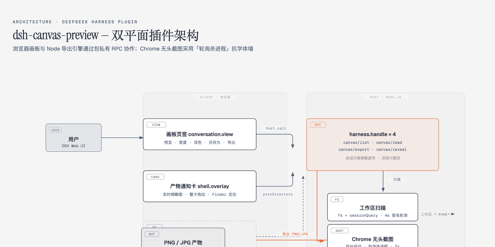

# 🎨 dsh-canvas-preview

**DeepSeek Harness 的画板预览插件 — AI 生成的网页产物，实时预览 · 一键高清导出**

*Canvas preview panel for [DeepSeek Harness](https://github.com/deepseek-ai/deepseek-harness) —
live-preview AI-generated HTML artifacts and export them as high-res PNG/JPG in one click.*

---

> ## 🤔 什么是 DeepSeek Harness？
>
> **[DeepSeek Harness（DSH）](https://github.com/deepseek-ai/deepseek-harness)** 是 DeepSeek 开源的
> **AI 智能体运行台**：浏览器里跑一个能读写文件、执行命令、调用工具的 AI 编程助手。
> 它的每一项能力都是一个 **Cordis 插件** —— 本项目就是其中之一。
>
> *DeepSeek Harness (DSH) is DeepSeek's open-source agent harness: a browser-based AI coding
> assistant whose every capability is a Cordis plugin. This project is one of them.*

---

## ✨ 它解决什么问题 / What it solves

用 DSH 做内容创作时，AI 经常生成**自包含 HTML 产物**——架构图、信息图、网页原型、幻灯片……
但你只能去文件夹里双击打开，来回切换窗口。

**dsh-canvas-preview 把「Gemini / Claude 的 Canvas 画板体验」带进 DSH**：

| | |
|---|---|
| 🖼 **画板页签** | 与「聊天」并排的独立视图，左侧文件列表 + 右侧沙箱实时预览 |
| 🔄 **自动同步** | 每 4 秒扫描工作区，AI 一保存你立刻看到，**无需手动刷新** |
| ↗️ **右上角通知卡** | AI 生成新产物瞬间弹出**实时渲染缩略图**，整卡可拖动、可展开、可调大小 |
| 📂 **另存为** | 原生 macOS 目录选择器，默认 HTML 同目录，可改存「下载」或任何位置 |
| 📥 **PNG/JPG 导出** | Chrome 无头引擎 **2 倍高清截图（3200×2400）· 约 2 秒出图**，点击结果直达 Finder |
| 🌓 **细节体验** | 宽度三档（适配/1280/手机竖屏）· 深色预览 · 导出耗时显示 |

## 🏗 架构 / Architecture

双平面 Cordis 插件：**Client 半**（浏览器）注册画板页签与通知卡，通过包私有 RPC
（`host.call ⇄ harness.handle`）调用 **Host 半**（Node.js）的文件扫描与导出引擎。
导出采用「Chrome 后台启动 + 轮询截图文件 + 稳定即杀」策略——不受被墙字体影响，永不挂起。

## 🚀 安装 / Install

> **当前 v0.1.0-WIP 以动态插件形态发布**（`dynamic/` 目录，源码即文档，DSH 创造模式即用）。
> `dsh plugin add` 一键安装的静态包在 Roadmap 的 v0.2。

**动态插件方式（现在就能用）**：

1. 克隆本仓库到任意位置（建议放 DSH 工作区）
2. 在 DSH 会话中对 Agent 说：
   > 按 `dsh-canvas-preview/dynamic/` 的 host.js + client.js 定义并运行画板插件
3. 批准一次插件运行 —— 画板页签即出现在会话顶部

## 🗺 Roadmap

- [x] 画板页签 · 文件列表 · 沙箱预览
- [x] 会话 cwd 智能定位扫描根
- [x] 自动同步（签名轮询，不重置用户选中）
- [x] 宽度适配 / 深色预览
- [x] 右上角产物通知卡（实时缩略图 + 整卡拖动 + 可调大小）
- [x] PNG/JPG 导出（2x · ~2s · 抗字体墙 · 会话沙箱策略直传）
- [x] 另存为（原生目录选择器）+ 导出后 Finder 定位
- [ ] **v0.2 · 静态包**：`dsh plugin add` 一键安装
- [ ] SVG 导出 · 自定义导出尺寸
- [ ] 英文文档与演示 GIF

## 🤝 参与贡献 / Contributing

欢迎 **Issue** 反馈 bug 与功能建议；欢迎 **Fork** 后自由修改（MIT 协议）。
PR 会被认真审阅。开发备忘（沙箱策略、Chrome 挂死等硬核经验）见
[`dynamic/README.md`](./dynamic/README.md)。

## 👤 作者 / Author

**jiuyuechuwuhao** — [GitHub 主页](https://github.com/jiuyuechuwuhao)

## 📄 License

[MIT](./LICENSE) © 2026 jiuyuechuwuhao
